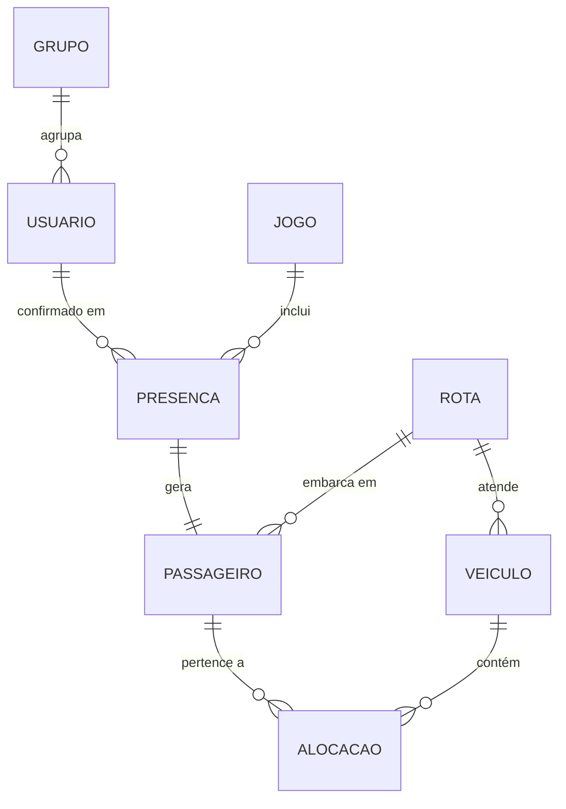
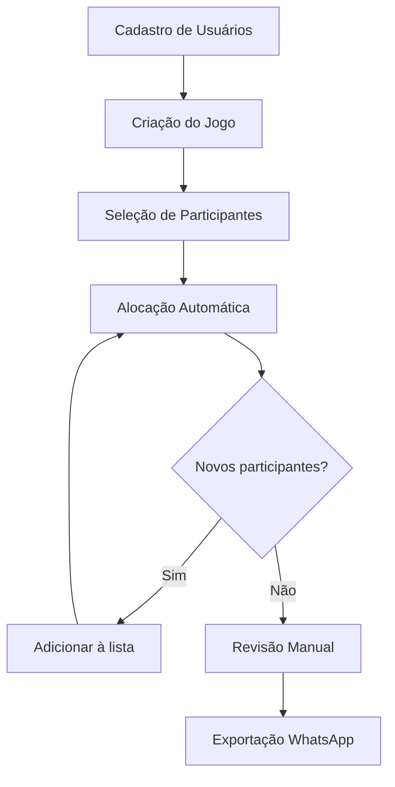
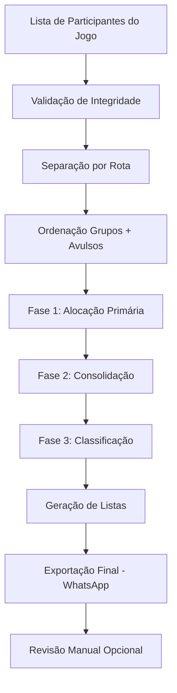
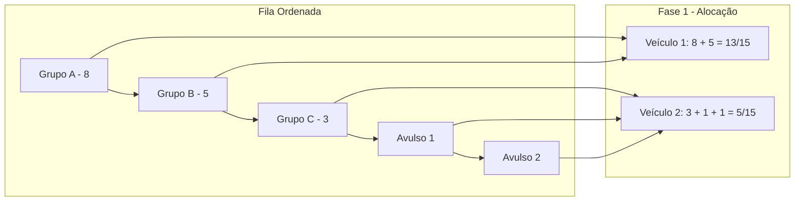
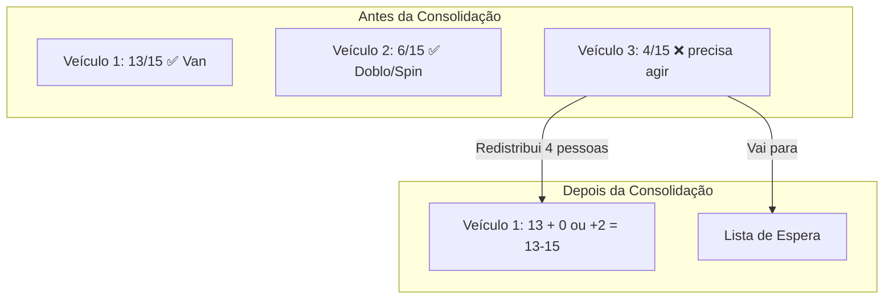

# 🚐 Carona Alvinegra — Gestor de Logística

**Sistema especializado de alocação automatizada de passageiros em veículos** para o trajeto Petrópolis → Estádio do Botafogo (RJ).  
O sistema resolve o problema de distribuição inteligente de passageiros respeitando restrições de **rota**, **capacidade**, **lotação mínima** e **integridade de grupos**, com saída formatada para leitura otimizada em dispositivos móveis (WhatsApp).

---

## Índice

1. [Introdução e Objetivos](#1-introdução-e-objetivos)
2. [Arquitetura Lógica — Entidades e Relacionamentos](#2-arquitetura-lógica--entidades-e-relacionamentos)
3. [Fluxo de Operação do Organizador](#3-fluxo-de-operação-do-organizador)
4. [Lógica do Algoritmo de Distribuição](#4-lógica-do-algoritmo-de-distribuição)
5. [Tratamento de Exceções](#5-tratamento-de-exceções)
6. [Exemplo de Saída para WhatsApp](#6-exemplo-de-saída-para-whatsapp)
7. [Requisitos Não-Funcionais](#7-requisitos-não-funcionais)
8. [Glossário](#8-glossário)

---

## 1. Introdução e Objetivos

### 1.1 Contexto

O **Carona Alvinegra** é uma iniciativa de torcedores do Botafogo residentes em Petrópolis que organizam transporte compartilhado em vans até o Estádio Nilton Santos (Engenhão) em dias de jogos. A gestão manual da alocação de dezenas de passageiros em múltiplas vans torna-se propensa a erros, retrabalho e conflitos de lotação.

### 1.2 Objetivos do Sistema

| Objetivo | Descrição |
|----------|-----------|
| **Manter cadastro de usuários** | Registrar torcedores com dados de contato para reutilização em múltiplos jogos. |
| **Selecionar participantes por jogo** | Permitir que o organizador escolha, a cada partida, quais usuários cadastrados irão. |
| **Alocar incrementalmente** | Reorganizar os veículos automaticamente conforme novos passageiros são adicionados à lista do jogo. |
| **Respeitar rotas** | Garantir que passageiros de rotas distintas **nunca** compartilhem o mesmo veículo. |
| **Preservar grupos** | Manter grupos de amigos/familiares sempre juntos no mesmo veículo. |
| **Respeitar capacidade** | Não ultrapassar o limite estrito de **15 passageiros** por veículo. |
| **Classificar veículo por lotação** | Nomear o veículo como **Van** (8-15 pessoas), **Doblo/Spin** (5-7 pessoas) ou **Lista de Espera** (1-4 pessoas). |
| **Gerar lista de espera** | Quando restarem menos de 5 pessoas sem veículo, colocá-las em uma lista de espera — transporte com menos de 5 é inviável. |
| **Gerar saída mobile** | Produzir listas numeradas de 1 a 15, formatadas para leitura rápida em WhatsApp. |
| **Permitir ajustes** | Viabilizar remanejamento manual pós-processamento sem quebrar as regras. |

---

## 2. Arquitetura Lógica — Entidades e Relacionamentos

### 2.1 Diagrama ER Lógico



### 2.2 Entidades e Propriedades

#### `Usuario`

Torcedor cadastrado no sistema, reutilizável em qualquer jogo.

| Propriedade | Tipo | Descrição |
|-------------|------|-----------|
| `id` | `UUID` | Identificador único |
| `nome` | `String` | Nome completo |
| `telefone` | `String?` | Contato WhatsApp (opcional) |
| `rota_preferencial` | `UUID` | Rota padrão de embarque (Bingen ou Quitandinha) |
| `grupo_id` | `UUID?` | Grupo ao qual pertence (opcional — `null` para avulsos) |
| `data_cadastro` | `DateTime` | Quando foi registrado no sistema |

#### `Jogo`

Representa uma partida específica para a qual o transporte será organizado.

| Propriedade | Tipo | Descrição |
|-------------|------|-----------|
| `id` | `UUID` | Identificador único |
| `adversario` | `String` | Nome do time adversário |
| `data` | `DateTime` | Data e horário do jogo |
| `local` | `String` | Estádio / local da partida |

#### `Presenca`

Registro de que um [`Usuario`](#usuario) participará de um [`Jogo`](#jogo) específico. A presença gera um [`Passageiro`](#passageiro) para aquela partida, que por sua vez receberá uma [`Alocacao`](#alocacao) em um [`Veiculo`](#veiculo).

| Propriedade | Tipo | Descrição |
|-------------|------|-----------|
| `id` | `UUID` | Identificador único |
| `usuario_id` | `UUID` | Usuário que confirmou presença |
| `jogo_id` | `UUID` | Jogo para o qual confirmou |
| `rota_efetiva` | `UUID` | Rota escolhida para este jogo (pode diferir da preferencial) |
| `confirmado_em` | `DateTime` | Quando a confirmação foi registrada |

#### `Passageiro`

Representação do [`Usuario`](#usuario) em um contexto específico de [`Jogo`](#jogo). Criado automaticamente a partir de [`Presenca`](#presenca).

| Propriedade | Tipo | Descrição |
|-------------|------|-----------|
| `id` | `UUID` | Identificador único |
| `usuario_id` | `UUID` | Referência ao usuário cadastrado |
| `presenca_id` | `UUID` | Referência à confirmação de presença |
| `jogo_id` | `UUID` | Jogo ao qual pertence |
| `nome` | `String` | Nome do passageiro (cópia do usuário no momento do jogo) |
| `rota_id` | `UUID` | Rota de embarque para este jogo |

> **Nota**: `Passageiro` não possui `grupo_id` próprio. O grupo é uma propriedade do [`Usuario`](#usuario) e herdada pelo passageiro via `usuario_id`. Isso garante que a filiação a grupos é consistente entre jogos.

#### `Grupo`

Agregação de usuários que **devem** permanecer juntos no mesmo veículo em **todos os jogos** que participarem.

| Propriedade | Tipo | Descrição |
|-------------|------|-----------|
| `id` | `UUID` | Identificador único |
| `nome` | `String` | Nome do grupo (ex.: "Família Silva", "Galera do Fernando") |

> **Nota**: O `tamanho` do grupo é dinâmico — depende de quantos membros do grupo confirmaram presença no jogo atual.

#### `Veiculo`

Unidade de transporte com capacidade limitada que percorre uma rota específica. Pode ser classificado como **Van**, **Doblo/Spin** ou **Lista de Espera** conforme sua lotação final.

| Propriedade | Tipo | Descrição |
|-------------|------|-----------|
| `id` | `UUID` | Identificador único |
| `rota_id` | `UUID` | Rota à qual o veículo está vinculado |
| `capacidade_maxima` | `Integer` | **Sempre 15** (constante do sistema) |
| `lotacao_atual` | `Integer` | Quantos lugares estão ocupados (campo derivado) |
| `vagas_restantes` | `Integer` | `capacidade_maxima - lotacao_atual` (campo derivado) |
| `fechado` | `Boolean` | Se o veículo já foi finalizado (não recebe mais alocações) |
| `tipo_veiculo` | `Enum` | Classificação definida na saída: `Van`, `Doblo_Spin` ou `Lista_Espera` |

> **Classificação** (definida apenas na etapa de saída):
> - **Van**: 8 a 15 passageiros
> - **Doblo/Spin**: 5 a 7 passageiros
> - **Lista de Espera**: Quando 1 a 4 passageiros não puderam ser alocados em nenhum veículo

#### `Rota`

Define o ponto de embarque. O sistema opera com exatamente duas rotas.

| Propriedade | Tipo | Descrição |
|-------------|------|-----------|
| `id` | `UUID` | Identificador único |
| `nome` | `String` | Nome da rota (ex.: "Bingen", "Quitandinha") |
| `local_embarque` | `String` | Descrição do ponto de encontro |

#### `Alocacao`

Entidade associativa que registra a relação entre um [`Veiculo`](#veiculo) e um [`Passageiro`](#passageiro).

| Propriedade | Tipo | Descrição |
|-------------|------|-----------|
| `id` | `UUID` | Identificador único |
| `veiculo_id` | `UUID` | Veículo alocado |
| `passageiro_id` | `UUID` | Passageiro alocado |
| `is_lider` | `Boolean` | Se o passageiro é o líder/contato do veículo |

### 2.3 Regras de Relacionamento

1. **Usuario → Presenca → Jogo**: 1 para N. Um usuário pode confirmar presença em vários jogos.
2. **Presenca → Passageiro**: 1 para 1. Cada confirmação gera exatamente um passageiro.
3. **Grupo → Usuario**: 1 para N. Um grupo contém 2 a N usuários. Usuários sem grupo (avulsos) têm `grupo_id = null`.
4. **Rota → Passageiro**: 1 para N. Um passageiro pertence a **uma única** rota por jogo.
5. **Rota → Veiculo**: 1 para N. Um veículo atende **exclusivamente** uma rota.
6. **Veiculo → Alocacao**: 1 para N. Um veículo pode conter de 0 a 15 alocações.
7. **Passageiro → Alocacao**: 1 para 1. Cada passageiro tem **exatamente uma** alocação ou vai para a **Lista de Espera**.

---

## 3. Fluxo de Operação do Organizador

### 3.1 Ciclo de Vida de um Jogo



### 3.2 Etapas do Organizador

#### Etapa A — Cadastro de Usuários

O organizador registra cada torcedor uma única vez no sistema:

- Nome completo
- Telefone WhatsApp
- Rota preferencial (Bingen ou Quitandinha)
- Grupo (opcional) — se pertence a um grupo, vincula ao grupo existente ou cria um novo

O cadastro é **persistente** e reutilizado em todos os jogos futuros.

#### Etapa B — Criação do Jogo

Para cada partida, o organizador cria um registro de jogo com:
- Adversário
- Data
- Local

#### Etapa C — Seleção de Participantes

O organizador **seleciona**, dentre os usuários cadastrados, quais irão ao jogo. Pode fazer isso de duas formas:

1. **Seleção em lote** — marca vários usuários de uma vez e confirma.
2. **Adição incremental** — adiciona usuários um a um, e o sistema realoca automaticamente a cada adição (ver [Seção 4.3](#43-alocação-incremental)).

O organizador também pode, no momento da seleção, alterar a rota de um usuário especificamente para aquele jogo (sobrescrevendo a rota preferencial).

#### Etapa D — Alocação Automática

O sistema executa o algoritmo de distribuição (ver [Seção 4](#4-lógica-do-algoritmo-de-distribuição)) sempre que a lista de participantes é modificada.

#### Etapa E — Revisão Manual

O organizador pode arrastar passageiros entre veículos da mesma rota. O sistema revalida as regras a cada movimentação.

#### Etapa F — Exportação

Geração do texto formatado para WhatsApp (ver [Seção 6](#6-exemplo-de-saída-para-whatsapp)).

---

## 4. Lógica do Algoritmo de Distribuição

Este é o **coração do sistema**. O algoritmo opera em três fases: **Alocação Primária (greedy)**, **Consolidação (mínimo de 11)** e **Classificação de Saída (Van / Doblo-Spin / Lista de Espera)**.

### 4.1 Fluxo de Processamento



### 4.2 Etapas Detalhadas

#### Etapa 1 — Obtenção dos Participantes

O sistema obtém a lista de passageiros para o jogo atual a partir das [`Presenca`](#presenca) confirmadas. Cada passageiro herda:
- O nome do [`Usuario`](#usuario) correspondente
- A rota definida na presença (ou a preferencial do usuário)
- O grupo do usuário (se houver)

#### Etapa 2 — Validação de Integridade

Antes de processar, o sistema valida:

| Verificação | Regra | Ação em Falha |
|-------------|-------|---------------|
| Passageiro sem rota | Todo passageiro deve ter uma rota definida | Rejeitar entrada |
| Grupo vazio | Grupo declarado deve ter ao menos 1 passageiro no jogo | Ignorar grupo vazio |
| Grupo > 15 | Nenhum grupo pode exceder a capacidade do veículo | Acionar exceção (*ver [Seção 5.1](#51-grupo-maior-que-a-capacidade-do-veículo)*) |
| Rota inconsistente | Todos os membros de um grupo devem pertencer à **mesma** rota | Rejeitar e informar conflito |

#### Etapa 3 — Separação por Rota

Os passageiros são divididos em **dois conjuntos independentes**: `Rota[Bingen]` e `Rota[Quitandinha]`.

> **Justificativa**: Passageiros de rotas diferentes **não podem** ocupar o mesmo veículo. A separação prévia elimina essa preocupação e simplifica o algoritmo.

Cada conjunto é processado isoladamente a partir da Etapa 4.

#### Etapa 4 — Ordenação dos Elementos

Dentro de cada rota, os elementos a alocar (grupos e avulsos) são organizados em uma **fila única** respeitando a seguinte prioridade:

1. **Grupos grandes primeiro** — ordenados do maior para o menor (número de membros **presentes no jogo** decrescente).
2. **Avulsos por último** — passageiros sem grupo são inseridos no final da fila.

**Motivação**: Alocar grupos grandes primeiro reduz a fragmentação e minimiza o desperdício de assentos.

#### Etapa 5 — Fase 1: Alocação Primária (Greedy com Preservação de Grupos)

O sistema percorre a fila ordenada e aplica o seguinte algoritmo:

```
para cada rota:
    veiculo_atual = novo Veiculo(capacidade = 15)
    
    para cada elemento na fila_ordenada:
        se elemento é GRUPO:
            se elemento.tamanho <= veiculo_atual.vagas_restantes:
                alocar GRUPO inteiro em veiculo_atual
            senão:
                finalizar veiculo_atual  # Fechamento provisório
                veiculo_atual = novo Veiculo(capacidade = 15)
                alocar GRUPO inteiro em veiculo_atual
        
        se elemento é AVULSO (1 passageiro):
            se veiculo_atual.vagas_restantes >= 1:
                alocar AVULSO em veiculo_atual
            senão:
                finalizar veiculo_atual  # Fechamento provisório
                veiculo_atual = novo Veiculo(capacidade = 15)
                alocar AVULSO em veiculo_atual

    finalizar veiculo_atual
```

**Visualização**:



#### Etapa 6 — Fase 2: Consolidação (Mínimo de 11)

Após a alocação primária, o sistema executa uma **segunda passada** para garantir que nenhum veículo não-último tenha menos de 11 passageiros.

**Regra**: Um veículo tipo **Van** pode ser considerado **fechado** apenas se tiver **11 ou mais passageiros**. A única exceção é o **último veículo de cada rota**, que pode ter qualquer quantidade.

> **Nota**: Veículos que ao final da consolidação ficarem com 5 a 7 passageiros serão classificados como **Doblo/Spin** na saída, e não precisam atingir o mínimo de 11. Já veículos com 1 a 4 passageiros são inviáveis e vão para **Lista de Espera** (tratado na Fase 3).

```
para cada rota:
    veiculos = lista de veículos da rota (ordenada por criação)
    
    para i de 0 até len(veiculos) - 2:   # Todos menos o último
        veiculo = veiculos[i]
        
        se veiculo.lotacao_atual >= 11:
            continuar  # Já ok
        
        # Se tem 5-7, pode ser Doblo/Spin - não precisa consolidar
        se veiculo.lotacao_atual >= 5:
            continuar  # Será classificado como Doblo/Spin na Fase 3
        
        # Tem menos de 5 - precisa preencher ou realocar
        deficit = 11 - veiculo.lotacao_atual
        vagas_disponiveis = veiculo.vagas_restantes  # 15 - lotacao_atual
        
        # Tentar 1: Puxar avulsos de veículos posteriores
        para j de i+1 até len(veiculos) - 1:
            avulsos_no_veiculo_j = listar_avulsos(veiculos[j])
            
            enquanto deficit > 0 E vagas_disponiveis > 0 E avulsos_no_veiculo_j não vazia:
                mover avulso do veiculo j para veiculo i
                deficit -= 1
                vagas_disponiveis -= 1
        
        se deficit <= 0:
            continuar  # Preenchida com sucesso
        
        # Tentar 2: Mover grupo pequeno inteiro de veículo posterior
        para j de i+1 até len(veiculos) - 1:
            grupos_no_veiculo_j = listar_grupos_pequenos(veiculos[j])
            para grupo em grupos_no_veiculo_j ordenados do menor para o maior:
                se grupo.tamanho <= vagas_disponiveis:
                    mover GRUPO inteiro do veiculo j para veiculo i
                    deficit -= grupo.tamanho
                    vagas_disponiveis -= grupo.tamanho
                    se deficit <= 0:
                        interrompe
        
        se deficit > 0 E veiculo.lotacao_atual < 5:
            # Esvaziar este veículo e distribuir seus passageiros
            # entre os outros veículos da mesma rota
            redistribuir_passageiros(veiculo, veiculos[i+1:])
            marcar veiculo como "LISTA_ESPERA"
```

**Visualização da Consolidação**:



**Importante**: Grupos **nunca** são quebrados. A consolidação move apenas grupos inteiros ou avulsos individuais.

#### Etapa 7 — Fase 3: Classificação de Saída

Após a consolidação, cada veículo de cada rota é classificado conforme sua lotação final:

| Lotação | Classificação | Ícone | Comportamento |
|---------|---------------|-------|---------------|
| 8 a 15 | **Van** | 🚐 | Veículo padrão, exibido normalmente |
| 5 a 7 | **Doblo/Spin** | 🚗 | Exibido como veículo menor (Doblò ou Spin) |
| 1 a 4 | **Lista de Espera** | ⏳ | Veículo **não é criado**. Os passageiros vão para uma lista de espera textual |

**Decisão de engenharia**: Um veículo com menos de 5 passageiros é economicamente e logisticamente inviável para o trajeto Petrópolis → Rio. Em vez de alocar um veículo subocupado, o sistema coloca esses passageiros em uma **lista de espera** para que o organizador busque alternativas (realocar em outros veículos, cancelar presença, etc.).

Regras da classificação:

1. **Ordem de verificação**: A classificação é aplicada após a Fase 2, quando todos os veículos já estão preenchidos.
2. **Veículos com 8+**: São nomeados "Van" sequencialmente (Van 01, Van 02...).
3. **Veículos com 5-7**: São nomeados "Doblo/Spin" sequencialmente (Doblo/Spin 01, Doblo/Spin 02...).
4. **Veículos com 1-4**: São dissolvidos. Os passageiros são movidos para a lista de espera da respectiva rota.
5. **Último veículo pode ser Doblo/Spin**: Diferente da regra dos 11 (que só se aplica a Vans), um último veículo com 5-7 pessoas é aceito como Doblo/Spin.

```
para cada rota:
    para cada veiculo em veiculos_da_rota:
        se veiculo.lotacao_atual >= 8:
            veiculo.tipo_veiculo = Van
        senão se veiculo.lotacao_atual >= 5:
            veiculo.tipo_veiculo = Doblo_Spin
        senão:
            # Lotacao 1 a 4 — vai para lista de espera
            mover todos os passageiros para lista_espera[rota]
            descartar veiculo
```

#### Etapa 8 — Geração de Listas

Para cada veículo, o sistema gera uma lista numerada de 1 a N (total de ocupantes):

- Identificação do veículo (Van 01, Doblo/Spin 01...)
- Rota
- Líder do veículo
- Lista numerada de passageiros (sem distinção de grupos na saída final)
- Total de passageiros no veículo

Para cada rota com lista de espera, uma seção adicional é gerada.

#### Etapa 9 — Exportação Final

Compilação em texto formatado para WhatsApp (ver [Seção 6](#6-exemplo-de-saída-para-whatsapp)).

#### Etapa 10 — Revisão Manual Opcional

Após a geração automática, o organizador pode fazer **remanejamentos manuais** entre veículos da **mesma rota**. O sistema revalida as regras de capacidade (15), classificação de veículo e integridade de grupos após cada movimentação.

### 4.3 Alocação Incremental

O sistema suporta a adição **gradual** de passageiros à lista do jogo. A cada adição, o algoritmo é reexecutado **do zero** (não incrementalmente).

> **Decisão de engenharia**: Embora uma abordagem incremental (adicionar apenas o novo passageiro ao veículo mais adequado) pudesse ser mais eficiente, a reexecução completa garante que:
> 1. O resultado é sempre o **mesmo** independente da ordem de inserção.
> 2. A consolidação (mínimo de 11) não é prejudicada por alocações anteriores subótimas.
> 3. A classificação final (Van / Doblo-Spin / Lista de Espera) reflete o estado atualizado.
> 4. O algoritmo permanece **determinístico** e previsível.

**Na prática**: Se o organizador adiciona 3 pessoas uma por uma, o sistema roda o algoritmo completo 3 vezes. Para o volume esperado (até 200 passageiros, processamento < 2s), isso é imperceptível.

---

## 5. Tratamento de Exceções

### 5.1 Grupo Maior que a Capacidade do Veículo (> 15)

| Situação | Ação |
|----------|------|
| Grupo com 16+ pessoas no jogo | **Bloquear alocação automática.** Exibir alerta: *"O grupo [nome] possui [N] integrantes confirmados neste jogo e excede a capacidade de um veículo (15 lugares). Sugerimos dividir manualmente o grupo em subgrupos de no máximo 15 pessoas antes de processar."* |

**Fundamento**: Como a regra de integridade de grupo exige que **todos** os membros estejam no mesmo veículo, um grupo > 15 é fisicamente impossível de alocar dentro das restrições do sistema.

### 5.2 Impossibilidade de Atingir Mínimo de 11 na Consolidação

| Cenário | Ação |
|---------|------|
| Não há avulsos ou grupos pequenos suficientes em veículos posteriores para preencher um veículo com < 5 | Os passageiros deste veículo são **redistribuídos** para outros veículos da mesma rota (se possível) ou vão para a **Lista de Espera**. Exibido no relatório: *"⏳ Lista de Espera — Rota [Y] — [N] passageiros. Transporte inviável para menos de 5 pessoas."* |
| Veículo não-último tem 5-7 após consolidação | **Não é considerado erro.** Será classificado como Doblo/Spin na saída. |

### 5.3 Lista de Espera

Quando, após a Fase 3, uma rota possui passageiros em lista de espera (1 a 4 pessoas que não completaram um veículo viável):

1. O sistema **não cria** um veículo para eles.
2. Os passageiros são listados em uma seção `⏳ *LISTA DE ESPERA*` na mensagem de saída.
3. O organizador pode:
   - Tentar realocar esses passageiros manualmente em veículos existentes (se houver vagas).
   - Contatá-los para cancelar a presença no jogo.
   - Aguardar novas confirmações de presença que possam completar um veículo.

### 5.4 Passageiro Sem Grupo Definido (Avulso)

Passageiros (usuários) com `grupo_id = null` são tratados como **avulsos** e alocados individualmente nos assentos restantes. Na consolidação, avulsos são a principal "moeda de troca" para preencher veículos com menos de 11.

### 5.5 Rota Sem Passageiros

Se uma rota possuir **zero** passageiros inscritos no jogo, nenhum veículo é criado para aquela rota. O sistema simplesmente omite a rota na saída.

### 5.6 Inconsistência de Rota em Grupo

Se um grupo tiver membros com rotas diferentes no mesmo jogo (ex.: parte em Bingen, parte em Quitandinha), o sistema:
1. **Rejeita** a entrada.
2. Exibe: *"Erro de integridade: o grupo [nome] possui membros em rotas distintas neste jogo. Todos os integrantes de um grupo devem pertencer à mesma rota."*

### 5.7 Usuário sem Presença em Nenhum Jogo

O sistema não impede o cadastro de usuários que nunca participaram de um jogo. O cadastro existe justamente para ser reutilizado futuramente.

---

## 6. Exemplo de Saída para WhatsApp

Abaixo, um exemplo realista da mensagem gerada pelo sistema para envio no WhatsApp. A formatação prioriza **legibilidade em tela estreita** (celular) com numeração sequencial simples de 1 a N por veículo, **sem exibição de grupos**.

```
🚐 *CARONA ALVINEGRA — ESCALA DE VANS*
📅 Botafogo x Flamengo — 10/05/2026
━━━━━━━━━━━━━━━━━━━━━━

📍 *ROTA — BINGEN*
━━━━━━━━━━━━━━━━━━━━━━

🚐 *Van 01* | 13/15 lugares
👤 Líder: Carlos Andrade

  01. Carlos Andrade
  02. Marina Andrade
  03. Lucas Andrade
  04. Sofia Andrade
  05. Pedro Andrade
  06. Ana Andrade
  07. João Andrade
  08. Tia Rosa
  09. José Almeida
  10. Felipe Costa
  11. Thiago Santos
  12. Rafael Lima
  13. Bruno Oliveira

─────────────────────────────

🚐 *Van 02* | 11/15 lugares
👤 Líder: Fernanda Torres

  01. Fernanda Torres
  02. Juliana Castro
  03. Patrícia Gomes
  04. Renata Souza
  05. Camila Dias
  06. Beatriz Martins
  07. Marcos Pereira
  08. Thiago Ribeiro
  09. Letícia Duarte
  10. Eduardo Nunes
  11. Amanda Lopes

─────────────────────────────

━━━━━━━━━━━━━━━━━━━━━━

📍 *ROTA — QUITANDINHA*
━━━━━━━━━━━━━━━━━━━━━━

🚐 *Van 01* | 15/15 lugares
👤 Líder: Ricardo Carvalho

  01. Ricardo Carvalho
  02. Sandra Carvalho
  03. Igor Carvalho
  04. Clara Carvalho
  05. Vó Lúcia
  06. Tio Paulo
  07. Prima Janaína
  08. André Luiz
  09. Diego Martins
  10. Gabriel Rocha
  11. Vinícius Castro
  12. Fábio Neves
  13. Roberta Lima
  14. Gustavo Henrique
  15. Monique Azevedo

─────────────────────────────

🚗 *Doblo/Spin 01* | 6/15 lugares
👤 Líder: Paula Mattos

  01. Paula Mattos
  02. Daniel Oliveira
  03. Aline Rocha
  04. Jorge Silva
  05. Cíntia Faria
  06. Leandro Pires

─────────────────────────────

⏳ *LISTA DE ESPERA — QUITANDINHA*
👤 3 passageiros sem veículo

  01. Mário Souza
  02. Elaine Costa
  03. Rodrigo Nunes

ℹ️ Transporte para menos de 5 pessoas é inviável.
   Organizador, avalie realocar ou cancelar.

━━━━━━━━━━━━━━━━━━━━━━
✅ *Total de passageiros: 48*
🚐 *Total de vans: 3*
🚗 *Doblo/Spin: 1*
⏳ *Lista de Espera: 3*
```

### 6.1 Estrutura da Mensagem

| Elemento | Formatação | Exemplo |
|----------|------------|---------|
| **Cabeçalho** | Negrito + emoji 🚐 | `*CARONA ALVINEGRA — ESCALA DE VANS*` |
| **Subtítulo** | 📅 + adversário + data | `📅 Botafogo x Flamengo — 10/05/2026` |
| **Separador de rota** | Emoji 📍 + nome | `📍 *ROTA — BINGEN*` |
| **Título do veículo (Van)** | 🚐 + nome + lotação | `🚐 *Van 01* \| 13/15 lugares` |
| **Título do veículo (Doblo/Spin)** | 🚗 + nome + lotação | `🚗 *Doblo/Spin 01* \| 6/15 lugares` |
| **Lista de Espera** | ⏳ + nome + total | `⏳ *LISTA DE ESPERA — QUITANDINHA*` |
| **Líder** | Emoji 👤 + nome | `👤 Líder: Carlos Andrade` |
| **Passageiros** | Numeração 01 a N, indentados | `  01. Carlos Andrade` |
| **Rodapé** | ✅ total + 🚐 vans + 🚗 doblo/spin + ⏳ espera | `✅ *Total de passageiros: 48*` |

### 6.2 Regras de Formatação

- **60 caracteres por linha** — evita quebra irregular em celular.
- **Numeração resetada por veículo** — cada van ou doblo/spin começa do `01`.
- **Numeração independente na lista de espera** — também começa do `01`.
- **Sem distinção de grupos** — a lista é plana. O organizador sabe quem são os grupos, mas o passageiro comum só precisa ver a numeração.
- **Emojis funcionais** — cada emoji tem um propósito: 🚐 = van, 🚗 = doblo/spin, 👤 = líder/pessoa, 📍 = local, ⏳ = espera, ✅ = total.
- **Ícone diferente por tipo de veículo** — 🚐 para Van (8+ pessoas), 🚗 para Doblo/Spin (5-7 pessoas).
- **Linhas de separação** — `━━━━━━` e `────────────────────` para hierarquia visual.

---

## 7. Requisitos Não-Funcionais

### 7.1 Cadastro Persistente

- Usuários, grupos e jogos devem ser armazenados de forma **persistente** (banco de dados local ou arquivo).
- O cadastro de usuários é **independente** de jogos — um usuário existe no sistema mesmo que nunca tenha ido a um jogo.

### 7.2 Flexibilidade e Remanejamento Manual

- Após a execução do algoritmo, o organizador pode **mover** passageiros ou grupos inteiros entre veículos da **mesma rota**.
- O sistema deve **recalcular e reexibir** as lotações e classificações após cada movimentação.
- O sistema deve **bloquear** movimentações que violem:
  - Limite de 15 passageiros por veículo.
  - Separação de rotas.
  - Integridade de grupos (grupo não pode ser fragmentado).
- Se um veículo passar de 7 para 8 passageiros com a movimentação, sua classificação deve mudar automaticamente de Doblo/Spin para Van.
- Se um veículo cair para menos de 5, seus passageiros devem ir para a lista de espera.

### 7.3 Performance

- O algoritmo deve processar até **200 passageiros** em menos de **2 segundos**.
- A complexidade esperada é **O(n log n)** dominada pela ordenação dos grupos.

### 7.4 Determinismo

- **Para a mesma entrada, a saída deve ser sempre idêntica** (algoritmo determinístico).
- A ordenação deve usar um critério de desempate estável (ex.: ordem alfabética do nome).
- A reexecução completa a cada adição incremental garante determinismo independente da ordem de inserção.

### 7.5 Saída Mobile-First

- A saída WhatsApp deve ter, no máximo, **60 caracteres por linha** para evitar quebra irregular em celular.
- Uso de emojis como indicadores visuais (🚐 van, 🚗 doblo/spin, 👤 líder, 📍 rota, ⏳ espera, ℹ️ informativo).
- Numeração simples de 1 a N — sem tabelas ou colunas largas.

### 7.6 Internacionalização (i18n)

- O sistema operará em **português brasileiro** como idioma único nesta versão.
- Nomes de entidades e mensagens de erro devem estar em pt-BR.

---

## 8. Glossário

| Termo | Definição |
|-------|-----------|
| **Alocação Incremental** | Adição gradual de passageiros à lista do jogo com reejecução completa do algoritmo a cada adição. |
| **Avulso** | Usuário/passageiro sem vínculo de grupo, alocado individualmente. |
| **Cadastro** | Base persistente de usuários independente de jogos específicos. |
| **Capacidade** | Número máximo de passageiros que um veículo pode transportar (fixo em 15). |
| **Classificação** | Etapa que define o rótulo de saída do veículo: Van (8-15), Doblo/Spin (5-7) ou Lista de Espera (1-4). |
| **Consolidação** | Segunda fase do algoritmo que remaneja avulsos e grupos pequenos para garantir o mínimo de 11 nos veículos tipo Van. |
| **Doblo/Spin** | Veículo menor (Fiat Doblò / Chevrolet Spin) com 5 a 7 passageiros. |
| **Fragmentação** | Sobra de lugares não utilizados, resultando em veículos subocupados. |
| **Greedy** | Algoritmo que toma a decisão localmente ótima em cada passo, sem reavaliação futura. |
| **Grupo** | Conjunto de usuários que devem obrigatoriamente ocupar o mesmo veículo em todos os jogos. |
| **Integridade de Grupo** | Restrição que proíbe a separação de membros de um mesmo grupo entre veículos distintos. |
| **Jogo** | Evento/partida específica para a qual o transporte é organizado. |
| **Líder** | Passageiro designado como ponto focal de um veículo (contato para comunicação). |
| **Lista de Espera** | Conjunto de passageiros que não puderam ser alocados por falta de número mínimo (menos de 5). |
| **Lotação Mínima** | Regra que exige no mínimo 11 passageiros para fechar uma Van (não se aplica a Doblo/Spin). |
| **Presença** | Confirmação de que um usuário participará de um jogo específico. |
| **Rota** | Local de embarque (Bingen ou Quitandinha) que define a separação primária dos veículos. |
| **Van** | Veículo grande com 8 a 15 passageiros. |

---

## Considerações Finais

O **Carona Alvinegra — Gestor de Logística** foi projetado com foco em **corretude** (respeito a todas as restrições), **simplicidade** (algoritmo determinístico e previsível) e **usabilidade** (saída pronta para consumo em WhatsApp).

A separação em três camadas de dados — **cadastro de usuários** (persistente), **presença em jogos** (seleção por evento) e **alocação em veículos** (por jogo) — permite que o organizador gerencie dezenas de torcedores ao longo de uma temporada inteira sem retrabalho cadastral.

O algoritmo de três fases (alocação primária + consolidação + classificação) garante que as três regras de negócio centrais — **capacidade máxima de 15**, **lotação mínima de 11 para vans** e **viabilidade mínima de 5 para qualquer veículo** — sejam simultaneamente satisfeitas, com a integridade dos grupos preservada em todo o processo.
