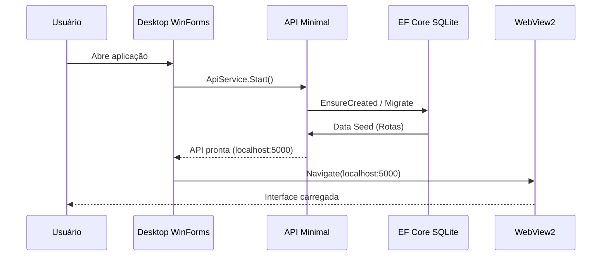

# 🏗️ Stack Tecnológica — Carona Alvinegra

## Visão Geral

```
┌─────────────────────────────────────────────────────────────┐
│                   Desktop Shell (WinForms)                   │
│                   ┌─────────────────────┐                    │
│                   │     WebView 2       │                    │
│                   │  (Interface React)  │                    │
│                   └──────────┬──────────┘                    │
│                              │ HTTP (localhost)              │
├──────────────────────────────┼──────────────────────────────┤
│                   ┌──────────┴──────────┐                    │
│                   │   Minimal APIs      │                    │
│                   │  (Controllers magros)│                   │
│                   └──────────┬──────────┘                    │
│                              │                               │
│              Camada de Application (Serviços)                │
│              ┌─────────────────────────────┐                 │
│              │  DTOs / AutoMapper / FluentValidation        │
│              └──────────┬──────────────────┘                 │
│                         │                                    │
│              Domain (Core do Negócio)                        │
│   ┌─────────────────────┼─────────────────────┐              │
│   │   Entidades         │   Domain Services    │             │
│   │   Value Objects     │   AlocadorService    │             │
│   │   Enums             │   (Algoritmo Core)   │             │
│   │   Interfaces (Repo) │                      │             │
│   └─────────────────────┴──────────────────────┘             │
│                         │                                    │
│              Infrastructure (Data)                           │
│   ┌──────────────────────────────────────────┐               │
│   │  EF Core / SQLite  │  Repositories       │               │
│   │  Migrations        │  Data Seed          │               │
│   └──────────────────────────────────────────┘               │
└──────────────────────────────────────────────────────────────┘
```

---

## Stack Principal

| Camada | Tecnologia | Versão | Função |
|--------|-----------|--------|--------|
| **Linguagem** | C# | 12 (.NET 8) | Linguagem principal |
| **Runtime** | .NET 8 | 8.0.x | LTS, suporte a longo prazo |
| **ORM** | Entity Framework Core | 8.0.x | Mapeamento objeto-relacional |
| **Banco** | SQLite | - | Banco local embutido (portátil) |
| **API** | ASP.NET Core Minimal APIs | 8.0.x | Endpoints HTTP enxutos |
| **Desktop Shell** | Windows Forms | 8.0.x | Orquestração da API + WebView2 |
| **WebView2** | Microsoft.Web.WebView2 | 1.0.x | Renderização da interface |
| **Container DI** | Microsoft.Extensions.DI | Nativo | Injeção de dependência nativa |

---

## Bibliotecas de Suporte

| Biblioteca | Propósito |
|-----------|-----------|
| **AutoMapper** | Mapeamento DTO ↔ Entidade |
| **FluentValidation** | Validação de DTOs na camada de Application |
| **Serilog** | Logging estruturado |
| **Swashbuckle / Swagger** | Documentação da API (desenvolvimento) |
| **xUnit + Moq** | Testes unitários do Domain Service |

---

## Estrutura da Solução

```
CaronaAlvinegra/
│
├── CaronaAlvinegra.sln
│
├── src/
│   │
│   ├── CaronaAlvinegra.Domain/                 # ── DOMAIN ──
│   │   ├── Entities/
│   │   │   ├── AggregateRoot.cs                # Base para aggregates
│   │   │   ├── Usuario.cs
│   │   │   ├── Grupo.cs
│   │   │   ├── Passageiro.cs
│   │   │   ├── Veiculo.cs
│   │   │   ├── Rota.cs
│   │   │   ├── Jogo.cs
│   │   │   ├── Presenca.cs
│   │   │   └── Alocacao.cs
│   │   ├── Enums/
│   │   │   └── ETipoVeiculo.cs
│   │   ├── Interfaces/
│   │   │   ├── IRepository.cs                  # Repositório genérico
│   │   │   ├── IUnitOfWork.cs
│   │   │   ├── IUsuarioRepository.cs
│   │   │   ├── IGrupoRepository.cs
│   │   │   ├── IJogoRepository.cs
│   │   │   ├── IVeiculoRepository.cs
│   │   │   ├── IRotaRepository.cs
│   │   │   └── IPassageiroRepository.cs
│   │   ├── Services/
│   │   │   ├── AlocadorService.cs              # ⭐ Algoritmo core
│   │   │   └── ValidadorDeIntegridade.cs
│   │   └── ValueObjects/
│   │       └── Lotacao.cs
│   │
│   ├── CaronaAlvinegra.Application/            # ── APPLICATION ──
│   │   ├── DTOs/
│   │   │   ├── UsuarioDto.cs
│   │   │   ├── CriarUsuarioDto.cs
│   │   │   ├── JogoDto.cs
│   │   │   ├── PresencaDto.cs
│   │   │   ├── VeiculoDto.cs
│   │   │   ├── AlocacaoDto.cs
│   │   │   ├── EscalaVansDto.cs               # Saída consolidada
│   │   │   └── ListaEsperaDto.cs
│   │   ├── Mappings/
│   │   │   └── AutoMapperProfile.cs
│   │   ├── Interfaces/
│   │   │   ├── IJogoService.cs
│   │   │   ├── IUsuarioService.cs
│   │   │   └── IAlocacaoService.cs
│   │   └── Services/
│   │       ├── JogoAppService.cs
│   │       ├── UsuarioAppService.cs
│   │       └── AlocacaoAppService.cs
│   │
│   ├── CaronaAlvinegra.Infrastructure/         # ── INFRASTRUCTURE ──
│   │   ├── Data/
│   │   │   ├── AppDbContext.cs
│   │   │   └── DataSeed.cs
│   │   ├── Repositories/
│   │   │   ├── UsuarioRepository.cs
│   │   │   ├── GrupoRepository.cs
│   │   │   ├── JogoRepository.cs
│   │   │   ├── VeiculoRepository.cs
│   │   │   ├── RotaRepository.cs
│   │   │   └── UnitOfWork.cs
│   │   └── Migrations/
│   │
│   ├── CaronaAlvinegra.Api/                    # ── PRESENTATION ──
│   │   ├── Program.cs                          # Startup completo
│   │   ├── Middlewares/
│   │   │   ├── LoginMiddleware.cs              # Validação de admin
│   │   │   ├── ErrorHandlingMiddleware.cs      # Tratamento global de erros
│   │   │   └── RequestLoggingMiddleware.cs     # Logging de requisições
│   │   ├── Endpoints/
│   │   │   ├── UsuarioEndpoints.cs
│   │   │   ├── JogoEndpoints.cs
│   │   │   ├── PresencaEndpoints.cs
│   │   │   ├── AlocacaoEndpoints.cs
│   │   │   └── ExportacaoEndpoints.cs
│   │   ├── appsettings.json
│   │   └── appsettings.Development.json
│   │
│   └── CaronaAlvinegra.Desktop/               # ── DESKTOP SHELL ──
│       ├── MainForm.cs                         # WinForms host
│       ├── MainForm.Designer.cs
│       ├── MainForm.resx
│       ├── ApiService.cs                       # Gerenciamento da API
│       ├── appsettings.json
│       └── wwwroot/                           # Frontend WebView2
│           ├── index.html
│           ├── css/
│           └── js/
│
├── tests/
│   ├── CaronaAlvinegra.Domain.Tests/
│   │   └── AlocadorServiceTests.cs            # Testes do algoritmo
│   └── CaronaAlvinegra.Integration.Tests/
│       └── AlocacaoEndpointsTests.cs
│
└── docs/
    ├── README.md                               # Especificação funcional
    └── STACK.md                                # Este arquivo
```

---

## Mapa de Dependências entre Camadas

```
┌──────────────┐
│   Desktop    │  → dependência de projeto
│  (WinForms)  │  → inicia/para a API via ApiService.cs
└──────┬───────┘
       │ HTTP (localhost:5000)
       ▼
┌──────────────┐     ┌────────────────┐     ┌────────────────┐
│     Api      │────▶│  Application   │────▶│  Infrastructure│
│ Minimal APIs │     │   Services     │     │  EF Core/SQLite│
└──────────────┘     └───────┬────────┘     └────────────────┘
                             │
                             ▼
                      ┌──────────────┐
                      │   Domain     │
                      │  (Core)      │
                      │  Alocador    │
                      └──────────────┘
```

**Regras de dependência (DDD):**
- `Domain`: Zero dependências externas. Puro C#.
- `Application`: Depende apenas de `Domain`.
- `Infrastructure`: Depende de `Domain` + pacotes EF Core.
- `Api`: Depende de `Application` + `Infrastructure`. Referência de projeto.
- `Desktop`: Depende de `Api` (via HTTP) + pacote WebView2.

---

## Fluxo de Inicialização



---

## Considerações sobre a Stack

### Por que Minimal APIs?
- Menos boilerplate comparado a Controllers tradicionais.
- Ideal para APIs pequenas e focadas como esta.
- Acoplamento direto com injeção de dependência nativa.
- Fácil integração com middleware pipeline.

### Por que WinForms + WebView2?
- WinForms gerencia o ciclo de vida da API (Start/Stop) de forma confiável.
- WebView2 renderiza uma interface moderna (HTML/CSS/JS) sem precisar de Electron.
- O frontend pode evoluir independentemente da shell.
- Alternativa: migrar o frontend para Blazor futuramente sem alterar a WinForms shell.

### Por que SQLite?
- Zero configuração de banco de dados.
- Banco único em arquivo `.db` — portátil entre máquinas.
- EF Core gerencia schema via Migrations.
- Ideal para uso local sem servidor.

### Por que DDD?
- O algoritmo de alocação é complexo e justifica um Domain Service isolado.
- Separação clara entre regras de negócio (Domain) e detalhes de infraestrutura.
- Testabilidade: o `AlocadorService` pode ser testado sem EF Core, sem banco, sem API.
